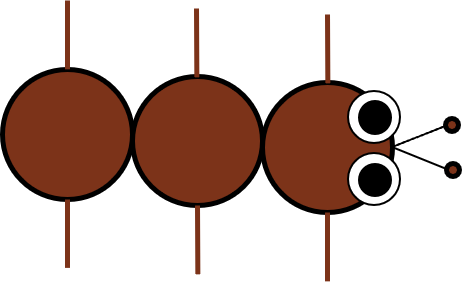

# FIND THE ANT

It is a game for young children, to keep them entertained when they are bored. It helps them to develop by learning to think strategically. Bright colours and friendly images, make it as eye catching as possible

# Aim
- Develop hand and eye coordination
- Learn to think strategically

# Installation
run "FindTheAnt.exe" file

# Background
This game was created for CE301 Capstone Project module, based on the Project Choices Database proposal by Riccardo Poli:
> In this project you will implement a game either as a PC programme or as an Android project. 
> The game can be played alone or with multiple players. The game is similar to minesweeper. There is an N x N board. The objective is to catch an ant which lives and moves underground (under the board). You can dig a hole in a square to see if the ant is there. If it is, you have won. If it isn't there are two possibilities. If the ant has never visited that square, you get no information on the whereabouts of the ant. If, instead, the ant has visited the square, you will find the ant's pheromone trail there, from which you will be able to infer how long ago the ant was there. This information can be used to decide where it is best to dig next.
> The ant moves pseudo randomly (but with a slight preference for going straight). However, notice that the ant does not leave pheromone in every square visited. She may decide to not drop pheromone at one step. Also, the world is toroidal (meaning that if the ant exits the board from one side, it re-enters it from the opposite side). Finally, the ant is not entirely random: it will avoid visiting the squares where you have drilled a hole. So, finding the ant is not terribly easy. Scores in the game should be proportional to how quickly one can find the ant.
> The objective of the project is to implement this game, exploring its variations and possibilities, including giving the ant some basic intelligence.

# Documentation
The [Documentation](https://cseegit.essex.ac.uk/ce301_21-22/CE301_shivakumar_hamsini/-/tree/master/Documentation) directory contains the following:
- [Final Report](https://cseegit.essex.ac.uk/ce301_21-22/CE301_shivakumar_hamsini/-/blob/master/Documentation/CE301%20Final%20Report%20(1804954).docx)
- [Project Poster](https://cseegit.essex.ac.uk/ce301_21-22/CE301_shivakumar_hamsini/-/blob/1d5d7828989df44856804370d7744d6d63d18f5b/Documentation/Poster.pptx)
- [Project Introduction](https://cseegit.essex.ac.uk/ce301_21-22/CE301_shivakumar_hamsini/-/blob/master/Documentation/Project%20introduction.docx)
- [Product Demonstration](https://cseegit.essex.ac.uk/ce301_21-22/CE301_shivakumar_hamsini/-/blob/master/Documentation/ProductDemonstration.mdhttps://cseegit.essex.ac.uk/ce301_21-22/CE301_shivakumar_hamsini/-/blob/master/Documentation/ProductDemonstration.md)
- [Product Implementation Report](https://cseegit.essex.ac.uk/ce301_21-22/CE301_shivakumar_hamsini/-/blob/master/Documentation/ProductImplementationReport.md)
- [Project Management](https://cseegit.essex.ac.uk/ce301_21-22/CE301_shivakumar_hamsini/-/blob/master/Documentation/ProjectManagement.md)
- [Testing Report](https://cseegit.essex.ac.uk/ce301_21-22/CE301_shivakumar_hamsini/-/blob/master/Documentation/TestingReport.md)

# Preview

# Author
Hamsini Shivakumar
Student ID: 1804954
